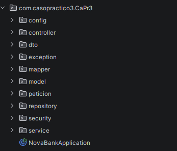
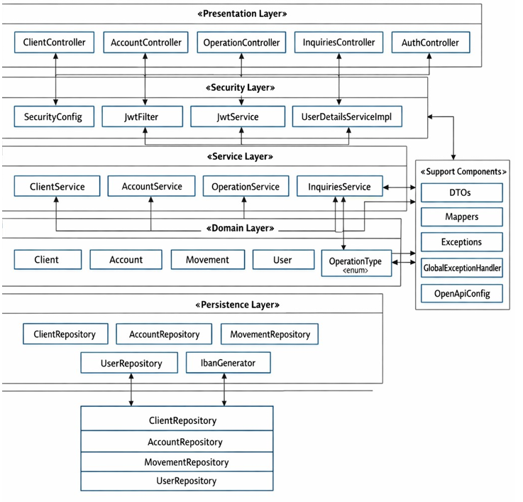
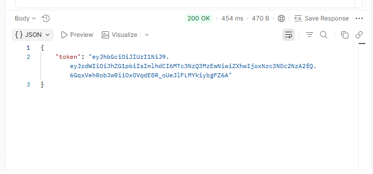
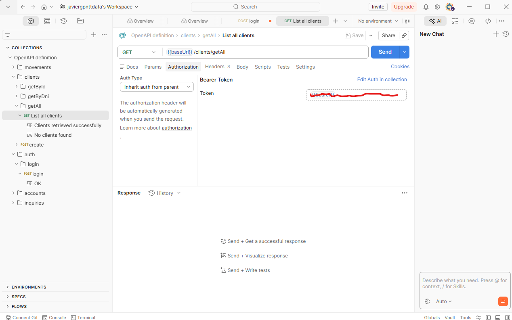
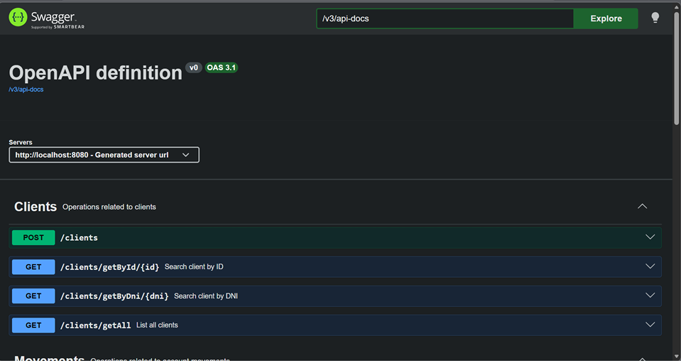
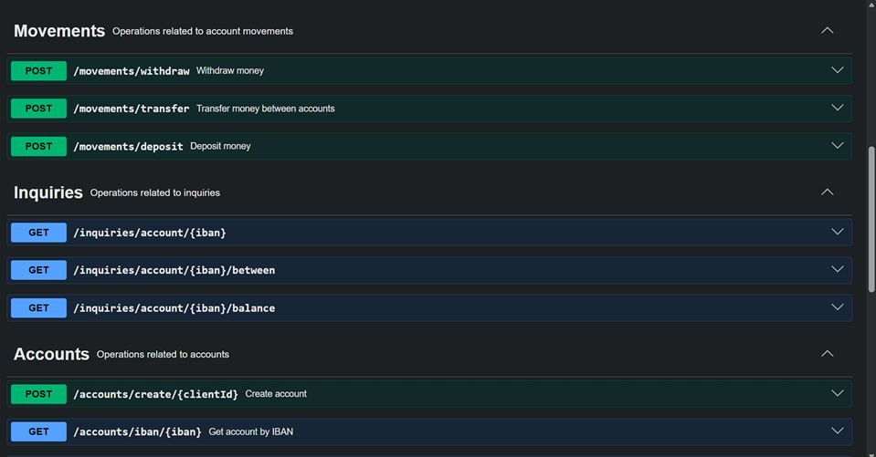

# NOVABANK DIGITAL SERVICES – Sistema de Gestión Bancaria

> NovaBank es un sistema de gestión bancaria transformado en una API REST robusta y escalable utilizando el ecosistema de Spring Boot. 
> El sistema permite la gestión integral de clientes, cuentas bancarias y operaciones financieras (depósitos, retiradas y transferencias) mediante servicios web protegidos. 
> La aplicación implementa una arquitectura orientada a servicios, persistencia en base de datos relacional y seguridad basada en tokens.

---

## Funcionalidades

### Autentificación de clientes
* Mediante token con Jwt

### Gestión de clientes
* Crear cliente
* Buscar cliente
* Listar clientes

### Gestión de cuentas
* Crear cuenta asociada a un cliente
* Listar cuentas de un cliente
* Ver información de una cuenta

### Operaciones
* Depósitos
* Retiros
* Transferencias

### Consultas
* Consultar saldo
* Ver movimientos de una cuenta
* Filtrar movimientos de una cuenta por rango de fechas

---

## Estructura del proyecto
* El proyecto está organizado por capas, de esta forma tenemos las responsabilidades separadas
* He eleigo esta arquitectura porque me parece mas correcta que otras, ya que hexagonal por ejemplo se puede quedar grande para este proyecto

---

## Autentificación para acceder a la API
* Desde una aplicacion como Postman, iremos a POST /auth/login e introduciremos esto en el body
`
{
  "username": "string",
  "password": "string"
}
`
* Sustituiremos username y password por el usuario creado de ejemplo en `src/main/java/com/casopractico3/CaPr3/config/SecurityConfig.java`, en el metodo init
* Nos dara un token si lo hacemos de manera correcta, ese token lo copiaremos y pegaremos como vereis en la proxima foto

## Documentacion de la API
* Se nos genera un enlace en local para que podamos ver la documentacion de la API
* El enlace para ir a ella es `http://localhost:8080/swagger-ui.html`, una vez que se este ejecutando
* Ahi estara indicado que hace cada endpoint.

## Instalacion de la base de datos
* En la carpeta resources se encuentra el archivo schema.sql, `src/main/resources/schema.sql`.
* Ejecuta este archivo en tu consola de PostgreSQL para crear la base de datos y las tablas necesarias.

---

## Patrones
* Repository
    - Se utiliza una interfaz para definir el contrato que deben cumplir los repositorios, permitiendo una arquitectura más desacoplada y mantenible.
* Builder
    - Utilizado en ClienteService para mejorar la legibilidad y claridad en la creación de objetos complejos.

---

## Tecnologías usadas
* Java 17
* Spring Boot 3.4.1
* Spring Data JPA
* Spring Security & JWT
* H2 Database
* Springdoc-openapi
* Lombok
* Maven
* JDBC
* JUnit 5
* Mockito
* PostgreSQL
* Git

---

## Requisitos del sistema
* Java 17 o superior
* Maven 3.9 o superior
* PostgreSQL instalado y en ejecución
* Herramienta de API, como Postman o Insomnia

---

## Configuración de la base de datos
* La conexión se gestiona desde `src/main/resources/application.yml`
* Desde ahí podrás gestionar las credenciales
* spring:
* datasource:
  - url: tu_url_base_datos
  - username: tu_usuario
  - password: tu_password

---

## Cómo compilar
`mvn clean compile`

## Cómo ejecutar
`mvn spring-boot:run`

## Cómo ejecutar los tests
* Se necesitaran las dependencias especificadas en el pom.xml para poder ejecutar todos los test
`mvn test`

---

## Repositorio
https://github.com/JaviergpNTTDATA/CasoPractico3